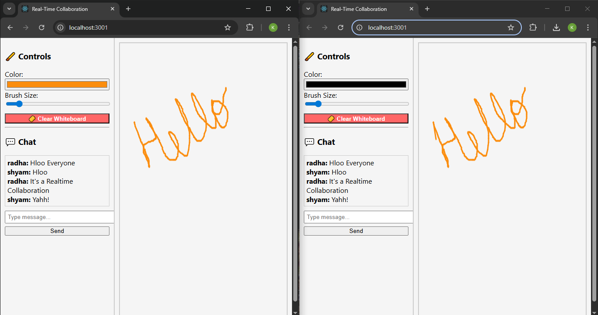

# 💬 Real-Time Collaboration Tool
bash
---

"COMPANY" : CODTECH IT SOLUTIONS
"NAME" : KASHISH KUMARI
"INTERN ID" : CT06DF642
"DOMAIN" : MERN STACK WEB DEVELOPMENT
"DURATION" : 6 WEEKS
"MENTOR" : Neela Santhosh

---

This real-time collaboration tool allows multiple users to draw on a shared whiteboard, chat instantly, and see live updates. Built using React on the frontend and Node.js with Socket.IO on the backend, the app focuses on synchronizing canvas drawings, real-time messages, and collaborative user interaction.
---

✨ Features
---

✅ Real-time Whiteboard Syncing
Drawings are broadcast live to all connected users.

✅ Usernames
Each participant is prompted for their name at login to identify their messages and actions.

✅ Chat System
Instant messaging box with usernames visible in the chat feed.

✅ Brush Color Picker
Choose any color for your drawing brush using a native color input.

✅ Brush Size Selector
Control the width/thickness of the drawing brush using a slider.

✅ Clear Whiteboard
One-click “🧽 Clear” button that erases the canvas for everyone connected.

✅ Responsive Layout
Adjusts for desktop screen sizes with scrollable chat and tools sidebar.

---

🛠️ Tech Stack
---

Frontend:

React.js

HTML5 Canvas API

CSS (inline and module)

Backend:

Node.js

Express.js

Socket.IO (WebSocket communication)

---

🚀 How to Run Locally
---

✅ Step 1: Clone the Repo
bash
Copy
Edit
git clone https://github.com/kashish-kumari-05/Realtime-Collaboration-tool.git
cd realtime-whiteboard-app

✅ Step 2: Install Backend Dependencies
bash
Copy
Edit
cd server
npm install
node index.js

✅ Step 3: Install Frontend (React Client)
bash
Copy
Edit
cd ../client
npm install
npm start

✅ Step 4: Open in Browser
Visit http://localhost:3000
(React client auto-launches on port 3000)

---

📁 Folder Structure
---

realtime-whiteboard-app/
│
├── client/            # React frontend
│   └── src/
│       ├── App.js     # Main component
│       ├── index.js   # Entry point
│       └── App.css    # Custom styles
│
├── server/            # Node.js backend
│   └── index.js       # Main server file
│
└── README.md

---

## 📸 Screenshots
---
### 🔍 live

